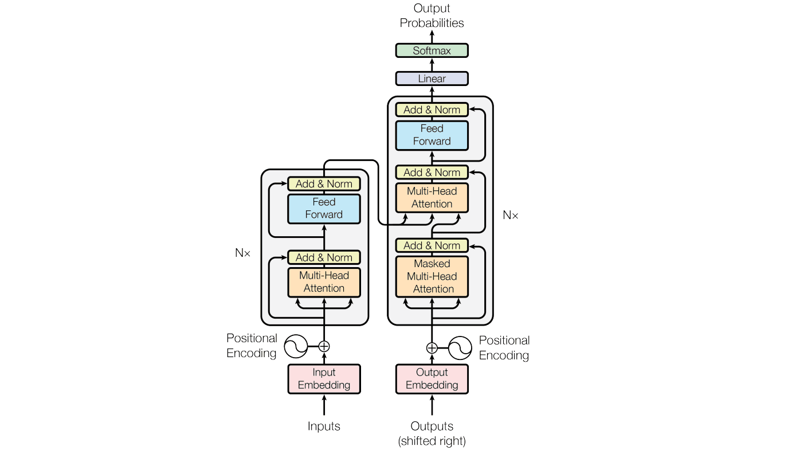

# 🧠 GPT From Scratch

A **decoder-only GPT language model** implemented from scratch in **PyTorch** to understand the core building blocks of modern Large Language Models. This project recreates the Transformer architecture without relying on high-level libraries like Hugging Face Transformers.

- Implementing the Transformer architecture from scratch
- Understanding self-attention and causal masking
- Building an autoregressive language model
- Training and generating text using PyTorch

## 📚 References

- Andrej Karpathy – *Let's Build GPT: From Scratch*
- *Attention Is All You Need* (Vaswani et al., 2017)

---

⭐ If you found this project interesting, consider giving it a star!
